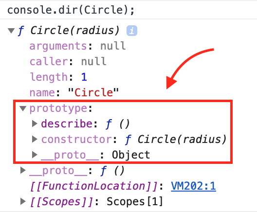
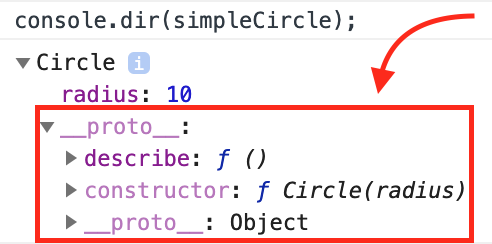

# 인스턴스(Instance)

우리는 영어 사용자가 아니므로 인스턴스(instance)라고 하면, 어떤 걸 말하는지 감이 잘 안온다.
모를 땐 구글신에게 물어봐야 하므로 검색을 해봤다.

> an example or single occurrence of something.

가장 윗 결과인 사전에서 위와 같이 설명했는데, 번역하면 "뭔가의 예시 또는 뭔가가 한번 나타난 것"이라고 한다.
조금 모호한 듯 해서 위키피디아에 검색해봤다.

> a concrete occurrence of any object, existing usually the runtime of a computer program.
> ...
> ... in prototype based programming, instantiation is instead done by copying(cloning) a prototype instance. - from Wikipedia

역시 기술 쪽으로 결과를 찾아보니 좀 구체적으로 나온다.
번역해보면, "객체가 견고하게 나타난 것. 보통 컴퓨터 프로그램의 런타임동안 존재한다. 프로토타입 기반 프로그래밍에서 인스턴스화는 프로토타입 인스턴스를 복사해서 이루어진다."
의역이 좀 심하게 됐지만 뜻은 전달 될 것 같다.
그런데, 여기서 프로토타입은 또 뭔가?

아무튼 뭔가 객체가 구체화 돼서 메모리 공간에 만들어진 것을 의미하는 것 같다.
프로토타입은 차차 알아보기로 하고, 이 인스턴스를 구체화해서 메모리 공간에 만드려면 어떻게 해야하는지 알아보자.

# 인스턴스를 만드는 네가지 방법

인스턴스를 만드는 것을 인스턴스화(instantiation)이라고 한다.
자바스크립트에서 인스턴스를 만드는 방법은 다음의 네가지가 있다.

1. Functional instantiation: 객체를 만들어서 반환하는 함수를 사용
2. Functional shared instantiation: 위와 동일하나, 메서드는 외부 객체에 만들고, 그 주소를 반환되는 객체에 할당
3. Prototypal instantiation: Object.create()를 통해 프로토타입 사용
4. Pseudoclassical instantiation: 프로토타입과 new키워드 사용

아주 거칠게 요약했기 때문에 무슨소리인지 모를 것이다.
아래에서 하나하나 설명할 예정이니 이해하지 못해도 괜찮다(글쓴이의 책임회피...).
그리고 위에서 얘기했던 프로토타입이 다시 등장했으니 먼저, 이것부터 해결하고 넘어가보자.

# 프로토타입(Prototype)

자바스크립트는 프로토타입 기반의 언어라고 불린다.
프로토타입은 사실 이전에 한번 공부했었는데,
[객체에 관한 이전 포스트]({{ site.baseurl }})에서는 객체 생성자와 프로토타입을 사용법 관점에서 얕게 이야기했었다.
이 포스트에서는 프로토타입에 대해 좀 더 깊게 알아보도록 하자.

이 포스트에서 사용했던 코드를 보면서 이야기를 시작해보자.

```javascript
function Circle(radius) {
  this.radius = radius;
}

var simpleCircle = new Circle(10);

Circle.prototype.describe = function () {
  return 'This circle has a radius of: ' + this.radius;
};

console.log(simpleCircle.describe()); // This circle has a radius of: 10
```

위 코드를 보면, 제일 윗줄에 선언된 `Circle` 생성자에는 `radius`라는 속성만 존재하고 `describe`라는 메서드는 존재하지 않았다.
이런 상태에서 `simpleCricle`이라는 객체를 `Circle` 생성자를 이용해 새로 만들었다.
그러니까 변수 `simpleCircle`에는 `Circle`에 의해 새로 만들어진 객체의 주소가 들어간다.
다음으로 `Circle`의 `prototype` 속성에 `describe`라는 메서드를 추가했다.
마지막 줄에서 `simpleCircle`의 메서드인 `describe`를 불러와서 결과를 출력한다.

잠깐, 분명 우리가 만들었던 `Circle` 생성자에는 `describe`라는 메서드는 커녕 속성도 없었는데,
어떻게 `prototype`에 있는 메서드를 용케 찾아냈을까?

만약에 생성자가 생성자 안에 만들어진 속성을 모두 복사하는 방식으로 새로운 객체를 만들었다면,
위의 두 객체의 `describe` 메서드는 실행되어서는 안된다.
그런 메서드는 존재하지 않아서, 복사되지 않았을 것이기 때문이다.

대체 무슨일이 일어난 걸까?

## prototype 속성과 \_\_proto\_\_ 속성

우선 위에서 `describe` 함수를 추가해줬었던 `prototype` 속성이 무엇인지부터 확인해보자.
`Circle`을 `console.dir()`을 통해 확인하면 다음과 같다.



<!-- <figure>
  
</figure> -->

여기서 보면 우리가 코드에서 해준 대로 `prototype`이라는 속성에 `describe`가 잘 들어간 것을 볼 수 있다.
이제 이 생성자 함수가 만든 인스턴스인 `simpleCircle`의 속성을 확인해보자.



<!-- <figure>
  
</figure> -->

생성자 함수인 `Circle`의 속성을 확인해볼 때보다 훨씬 간단해보인다.
먼저 `prototype`이라는 속성이 존재하지 않는다는 것을 발견할 수 있다.
그리고 `__proto__`라는 속성에 담긴 것이 생성자의 속성에 있는 `prototype` 속성과 상당히 유사해 보인다는 것도 발견할 수 있을 것이다.

이름 때문에 매우 헷갈릴 수 있는데, `prototype` 속성은 확인했듯이 생성자 함수에만 존재한다.
이 속성에는 이 함수를 통해 생성될 인스턴스의 프로토타입이 될 객체의 주소가 들어있다.
이 프로토타입 객체는 함수가 정의될 때, 생성자(이것 때문에 `new` 키워드를 사용해 객체를 만들어낼 수 있다)와 함께 생성되고, 생성된 프로토타입 객체와 생성자를 가리키는 주소가 `prototype`과 `constructor`에 들어가게 된다.

`__proto__`는 모든 객체(자바스크립트에서는 모든 것이 객체)에 들어있는(Object 객체와 null은 제외) 속성으로,
생성자에도, 인스턴스에도 들어있다.
여기에는 객체의 프로토타입을 가리키는 주소가 들어있다.

## 프로토타입 체인(Prototype chain)

이제 어느정도 그림이 그려질 것이다.
지금까지 알아낸 것으로 위의 상황을 재구성해보자.

- `Circle`이 정의되면서, 프로토타입 객체가 만들어졌다.
- 이 프로토타입 객체를 가리키는 주소는 `prototype`에 들어갔다.
- `new Circle(10)`으로 새 인스턴스 `simpleCircle`이 만들어지면서, `simpleCircle`의 `__proto__` 속성에 `Circle.prototype`에 담긴 주소가 들어갔다.
- `Circle`이 생성한 프로토타입 객체에 `describe` 메서드를 추가했다.
- `Circle`의 인스턴스인 `simpleCircle`이 `describe`에 접근해 함수를 실행했다.

이제 프로토타입에 메서드가 추가돼서, 인스턴스 `simpleCircle`이 이 메서드 정보에 접근할 수 있다는 것까지는 이해될 것이다.
마지막 부분은 좀 모호한데, 이 정보를 어떻게 찾아오는지가 설명되지 않았기 때문이다.
다시말하면, `simpleCircle.__proto__.describe()`가 실행되는 것은 이해가 되지만, `simpleCircle.describe()`가 어떻게 실행되는 것인지는 이해되지 않는다는 것이다.

결론부터 이야기하면, 이것은 프로토타입 체인 때문에 일어나는 일이다.
객체의 속성을 참조하면, 객체는 자기 자신이 그 속성을 갖고있는지 먼저 확인한다.
자신이 갖고 있지 않다면, 이제는 `__proto__` 속성에 담긴 주소에서 속성이 있는지 찾는다.
이 프로토타입 객체도 갖고있지 않다면, 이 프로토타입 객체의 프로토타입 객체로 찾아가 속성을 찾는다.
이렇게 계속 프로토타입을 따라가면서 속성을 찾는 것을 프로토타입 체인이라고 한다.

이제는 모든 상황이 이해될 것이다.
`simpleCircle.describe()`가 실행될 수 있었던 것은, 이 인스턴스의 프로토타입에 `describe` 함수가 있었고, 프로토타입 체인 덕분에 프로토타입으로 찾아가 `describe`를 발견할 수 있었기 때문이었다!

# 인스턴스를 만드는 방법

이제 충분히 프로토타입을 이해한 것 같으니, 아까 살짝 살펴봤던 인스턴스를 만드는 네가지 방법을 자세히 알아보자.

- Functional instantiation
- Functional shared instantiation
- Prototypal instantiation
- Pseudoclassical instantiation

## 첫번째 방법: Functional Instantiation

이 방법은 함수를 만들고 그 함수 내부에서 새로운 객체를 만든 뒤,
거기에 속성과 메서드를 추가한 뒤 반환하는 방식이다.
이때 객체를 만들어내는 함수를 Decorator라고 부르는데,
Decorator는 객체를 인자로 받아서 속성과 메서드를 추가하는 함수를 말한다.
보통은 이 Decorator 이름으로 형용사를 사용한다.

```javascript
function creatingFootballClub(name, stadium) {
  var club = {};

  club.name = name;
  club.stadium = stadium;
  club.describe = function () {
    console.log(this.stadium + ' is home of ' + this.name);
  };

  return club;
}

var liverpool = creatingFootballClub('Liverpool', 'Anfield');
var barcelona = creatingFootballClub('Barcelona', 'Camp Nou');
liverpool.describe(); // "Anfield is home of Liverpool"
barcelona.describe(); // "Camp Nou is home of Barcelona"
```

## 두번째 방법: Functional Shared Instantiation

Functional Instantiation 방법에는 큰 단점이 있다.
함수가 생성되는 객체마다 따로따로 존재해서 메모리가 낭비된다는 것이다.
이를 해결하기 위해 Functional Shared Instantiation 방법은 함수를 외부에 만들고, 모든 객체에 extend라는 함수로 그 주소만 넘겨주는 방법을 사용한다.

```javascript
function extend(to, from) {
  for (var key in from) {
    to[key] = from[key];
  }
}

var methods = {};
methods.describe = function () {
  console.log(this.stadium + ' is home of ' + this.name);
};

function creatingFootballClub(name, stadium) {
  var club = {};

  club.name = name;
  club.stadium = stadium;
  extend(club, methods);

  return club;
}

var liverpool = creatingFootballClub('Liverpool', 'Anfield');
var barcelona = creatingFootballClub('Barcelona', 'Camp Nou');
liverpool.describe(); // "Anfield is home of Liverpool"
barcelona.describe(); // "Camp Nou is home of Barcelona"
```

## 세번째 방법: Prototypal Instantiation

세번째 방법은 이름이 보여주듯 프로토타입을 사용한 방법이다.
여기서는 `Object.create()`라는 static 함수를 사용한다.
`Array.isArray()`같이 static 함수는 인스턴스 없이 실행되는 함수를 말한다.
이 `Object.create()` 함수는 인자로 들어온 객체를 프로토타입으로 하는 객체를 만든다.
주의할 것은 이 함수로 만들어진 객체는 `new` 키워드로 생성된 객체와 달리 `constructor` 속성을 갖지 않는다.
따라서 `constructor` 속성이 필요하면(new를 사용하려면), 직접 지정해줘야한다.

```javascript
var methods = {};
methods.describe = function () {
  console.log(this.stadium + ' is home of ' + this.name);
};

function creatingFootballClub(name, stadium) {
  var club = Object.create(methods);

  club.name = name;
  club.stadium = stadium;

  return club;
}

var liverpool = creatingFootballClub('Liverpool', 'Anfield');
var barcelona = creatingFootballClub('Barcelona', 'Camp Nou');
liverpool.describe(); // "Anfield is home of Liverpool"
barcelona.describe(); // "Camp Nou is home of Barcelona"
```

## 네번째 방법: Pseudoclassical Instantiation

가장 자주 사용되는 방법이다.

```javascript
function FootballClub(name, stadium) {
  this.name = name;
  this.stadium = stadium;
}

FootballClub.prototype.describe = function () {
  console.log(this.stadium + ' is home of ' + this.name);
};

var liverpool = new FootballClub('Liverpool', 'Anfield');
var barcelona = new FootballClub('Barcelona', 'Camp Nou');
liverpool.describe(); // "Anfield is home of Liverpool"
barcelona.describe(); // "Camp Nou is home of Barcelona"
```

# 참고

- 코드스테이츠의 Immersive 코스 강의
- [오승환님의 블로그](https://medium.com/@bluesh55/javascript-prototype-%EC%9D%B4%ED%95%B4%ED%95%98%EA%B8%B0-f8e67c286b67)
- [[Youtube의 FunFunFunction 영상]`__proto__` vs `prototype`](https://www.youtube.com/watch?v=DqGwxR_0d1M))
